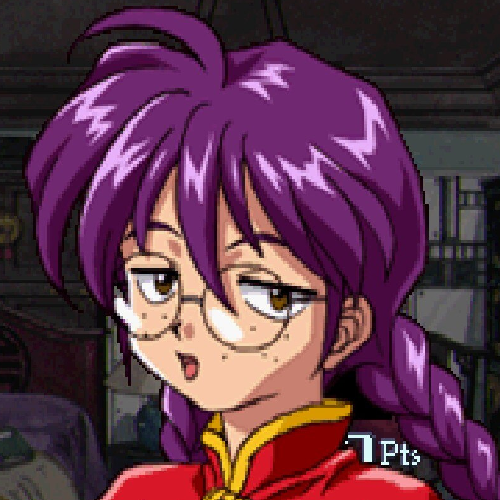

# Week 2 Attendance Site
---
## Night prior
Worked on CIT 48 classwork. Talked to friends while watching whatever game they were streaming to the group. \
after finishing classwork began doing drawing practice whilst watching/streaming the *Patlabor* OVA to the group. \
Putting the series name in italics and specifying the ova feels incredibly forced. I didn't enjoy writing that. \
Knew I could have work tomorrow but went to sleep rather late because it would be the first day[^1] of the FUSD semester. \
I took screenshots of the OVA as I watched which I will include. VLC is a good media player.~I realize now after \
uploading them^1^ that they still have their long original name and timestamp in them. This is helpful for sorting \
but awful for calling on...~

1.  Shot from the opening. I like Noa's smile here.

2. Later shot. Nothing of particular note but I'm fond of characters in Mecha series that have a fondness for the robots.\
They're rarer than you'd think, and Noa's an especially fun example of one. 

3. Commercial Eyecatch. Cool shot of the Patlabor in a firing pose. The english logo underneath is actually a part of\
the subtitles! Very cool. Is your scrolling finger tired yet? I hope so.

4. I like the way this shot is framed. I wanted to get a screenshot with the lights pulsing but wasn't able to and \
trying to get one got quickly annoying. 

5. Nothing of note here compared to anything else in the series. I think the small frown on her face is funny here.

## Morning
Woke up to get ready for potential work call, though already felt it wasn't going to come in.[^2] Began working on \
other classwork as well as starting to look through the work due today that I'd not gotten done yet. **Continued** \
frustrated communications with other online professor over not wanting to post my face online.\

## Now
Working on website. Ran multiple test commits to see how things would display to avoid having to learn *after* \
already writing down what I felt like including. Note that after I wrote this I began testing things again after already\
having written more. Oops^2^.

## Later
I need to do the other assignments. I understand why they're placed behind the Attendance but I really wish I could know \
what I was going to get into later prior to working on this one. Once I'm done with those I want to do more drawing practice \
and also watch more Patlabor. I'd like the play deadlock later as it got a new update. I've enjoyed writing this. \
Typing on a keyboard feels really nice. I still need to include an unordered list for the assignment. \
I'll restate the previous section as an unordered list.\

- Do other assignments
- Draw
- Watch patlabor
- Play deadlock

\ 
that should do.

`Ah I still have to include a code block and a link to something. Oops ^3^`
[Here's a link back to the markdown cheat sheet we were given for the assignment.](https://www.markdownguide.org/cheat-sheet/)
I forgot to update the codespace after I uploaded the screenshots. Oops^4^.

**bold test (sub title?)**
 *italics*
 

 >block quote

 1. ordered
 2. list
 3. test

 - unordered 
 - list
 - test

 `code`

 ---

 [link test](https://www.markdownguide.org/cheat-sheet/)

 [^1]: No one ever needs a subsitute on the first day
 [^2]: See footnote 1 [^1]